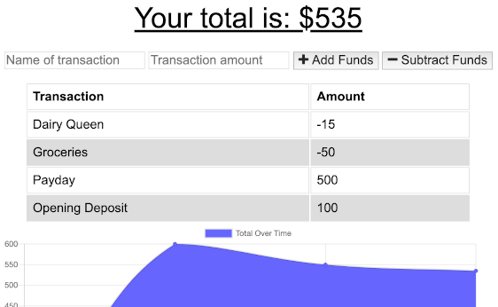

# PWA Budget Tracker

## Description

An application that allows you to track your budget whether you are online or offline. Simple graph helps you see how you are doing. Use this app to help you save up money!

## [Try it yourself!](https://shielded-crag-85196.herokuapp.com/)

The following image shows a glimpse of the application:

## Getting Started

This is a simple application that runs right in the browser, no installation or downloads needed.

## Built With:

JavaScript - programming language  
Node.js - JavaScript runtime  
Express - Node.js web application framework  
MongoDB - database 
Mongoose - database schema

## Author:

Brittany Fortner  
See commit history [here](https://github.com/bfeliz/pwa-budget-tracker/graphs/contributors).

## Planned Updates

There are no plans to further update this application at this time.
